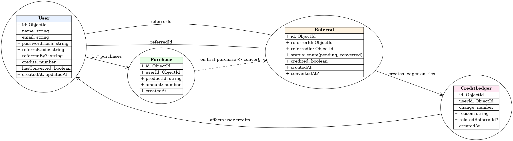

📌 Overview

This project implements a complete referral-based credit system similar to what digital platforms use (courses, SaaS tools, e-book stores, credit stores, etc.).
Users can:
Register & Login
Get a unique referral link
Share it with others
Earn credits when referred users make their first purchase
View all analytics on a dashboard
See referral counts, conversions, credits, and activity
Backend is deployed on Render, frontend on Render, and database on MongoDB Atlas.
This fulfills all requirements from the assignment: authentication, referral logic, credit awarding, double-credit prevention, concurrency safety, dashboard metrics, clean UI, and documentation.

🎯 Features
🔐 Authentication
Secure Register/Login
Password hashing using bcrypt
JWT authentication
Auth cookie (httpOnly, secure, sameSite="none") for protected routes

🧩 Referral System
Every user receives a unique referral code
Users signing up with referral code are linked automatically
First purchase by referred user triggers credits
2 credits → Referrer + Referred User
Zero duplicate credits (atomic logic)

🛒 Purchase Simulation
“Buy -100” triggers referral conversion logic
Subsequent purchases DO NOT give more credits
Prevents abuse and double-transactions

📊 User Dashboard
Shows:
Total Referred Users
Total Converted Users
Credits Earned
Unique Referral Link
Referral analytics

💾 Data Safety & Integrity
No double-crediting
Prevents race conditions
Atomic DB updates
Clean schema design

🛠️ Tech Stack
Frontend
Next.js 14+
TypeScript
Tailwind CSS
Zustand (state management)
Framer Motion (animations)
Fetch API / Axios for API calls

Backend
Node.js + Express + TypeScript
JWT Authentication
Secure Cookies
Modular Routes & Controllers

Database
MongoDB / Mongoose

DevOps / Deployment
Frontend: Render
Backend: Render
Database: MongoDB Atlas

⚙️ Environment Variables
Backend (/backend/.env)
PORT=5000
MONGO_URI=YOUR_MONGO_URL
JWT_SECRET=YOUR_SECRET
NODE_ENV=production

Frontend (/frontend/.env)
NEXT_PUBLIC_BACKEND_URL=https://creditsystem-h89y.onrender.com

🚀 How to Run Locally
Clone the repo

📌 Backend Setup
cd backend
npm install
npm run dev
Backend runs at:http://localhost:5000

Frontend Setup
cd frontend
npm install
PORT=3000 npm run dev

🔗 API Endpoints
Auth Routes
Method	    Endpoint	    Description
POST	    /auth/register	    Register a new user
POST	    /auth/login	        Login and receive token + cookie
Referral Routes
Method	    Endpoint	    Description
GET	        /users/me	    Get current user info
GET	        /referrals	    Get referral stats
Purchase Routes
Method	    Endpoint	Description
POST	    /purchase	Simulates purchase and triggers credit logic

🔐 Security Implementations

Bcrypt hashed passwords
JWT tokens stored in httpOnly cookies
secure + sameSite:"none" for cross-site auth
Validations on both server & client
No plain text secrets
Modular middleware-based authorization

Deployment
Backend

Deployed on Render:
👉 https://creditsystem-h89y.onrender.com

Frontend
Deployed on Render :
👉 https://creditsystem-1.onrender.com

🏁 Conclusion
This project demonstrates the complete engineering workflow expected from a full-stack developer:
Understanding business logic
Designing scalable schema
Managing referral and credit logic
Implementing reliable API
Clean UI + animations
Secure authentication
Full deployment
Strong documentation
It fulfills all requirements listed in the assignment.

UML Diagram:

github repo:https://github.com/RitikaDutta0901/creditSystem.git
